# language-models-from-scratch

A ground-up implementation of character-level language models in PyTorch, progressing from bigram counting statistics to a GPT-style Transformer. Every model is trained on the same 32,033 names, evaluated on the same 80/10/10 split, and scored with the same negative log-likelihood metric so the numbers are directly comparable.

The goal is to understand why each architecture works, not just how to run it. Each model is introduced because the previous one had a concrete limitation, and each notebook documents the reasoning behind every design decision alongside the code.

---

## The progression

| Model | Notebook | Script | Context | Parameters | Train NLL | Val NLL |
|---|---|---|---|---|---|---|
| Bigram counting | `01` | `01_bigram_counting.py` | 1 char | 729 | 2.45 | 2.45 |
| Bigram neural net | `01` | `01_bigram_neural.py` | 1 char | 729 | 2.49 | 2.49 |
| MLP | `02` | `02_mlp_language_model.py` | 3 chars | 11,897 | 2.12 | 2.16 |
| Deep MLP + BatchNorm | `03` | `03_activations_batchnorm.py` | 3 chars | 47,024 | 2.00 | 2.08 |
| WaveNet | `04` | `04_wavenet.py` | 8 chars | 76,579 | 1.77 | 1.99 |
| Transformer | `05` | `05_transformer_name_generation.py` | 16 chars | 303,387 | 1.91 | 2.00 |

---

## Repository structure

```
language-models-from-scratch/
├── data/
│   └── names.txt                  # 32,033 first names, one per line
├── models/                        # standalone runnable scripts, one per model
│   ├── 01_bigram_counting.py
│   ├── 01_bigram_neural.py
│   ├── 02_mlp_language_model.py
│   ├── 03_activations_batchnorm.py
│   ├── 04_wavenet.py
│   └── 05_transformer_name_generation.py
├── notebooks/                     # derivation notebooks with full explanations
│   ├── 01_bigram_language_model.ipynb
│   ├── 02_mlp_language_model.ipynb
│   ├── 03_activations_gradients_batchnorm.ipynb
│   ├── 04_wavenet.ipynb
│   └── 05_transformer_name_generation.ipynb
├── outputs/
│   ├── plots/                     # all generated figures
│   └── generated_names/           # sampled names from each trained model
├── utils/
│   └── diagnostics.py             # reusable training diagnostic functions
└── requirements.txt
```

---

## How to run

```bash
git clone https://github.com/Nur2424/language-models-from-scratch
cd language-models-from-scratch
pip install -r requirements.txt
```

Each script runs independently from the repo root:

```bash
python models/01_bigram_counting.py
python models/01_bigram_neural.py
python models/02_mlp_language_model.py
python models/03_activations_batchnorm.py
python models/04_wavenet.py
python models/05_transformer_name_generation.py
```

Each script saves its plots to `outputs/plots/` and generated names to `outputs/generated_names/`.

---

## Model 01 — Bigram (counting and neural)

**The limitation it starts from:** no model at all. We need a baseline.

**The idea:** count how often each character follows each other character across all 32k names. Normalize the counts into a probability row per character. Sample the next character from that row. This is the simplest possible language model and requires no training.

The neural version learns the same statistics via gradient descent on a single weight matrix W (27x27), demonstrating that `one_hot @ W` is equivalent to a row lookup. Both reach the same NLL (~2.45) because they are mathematically the same model.

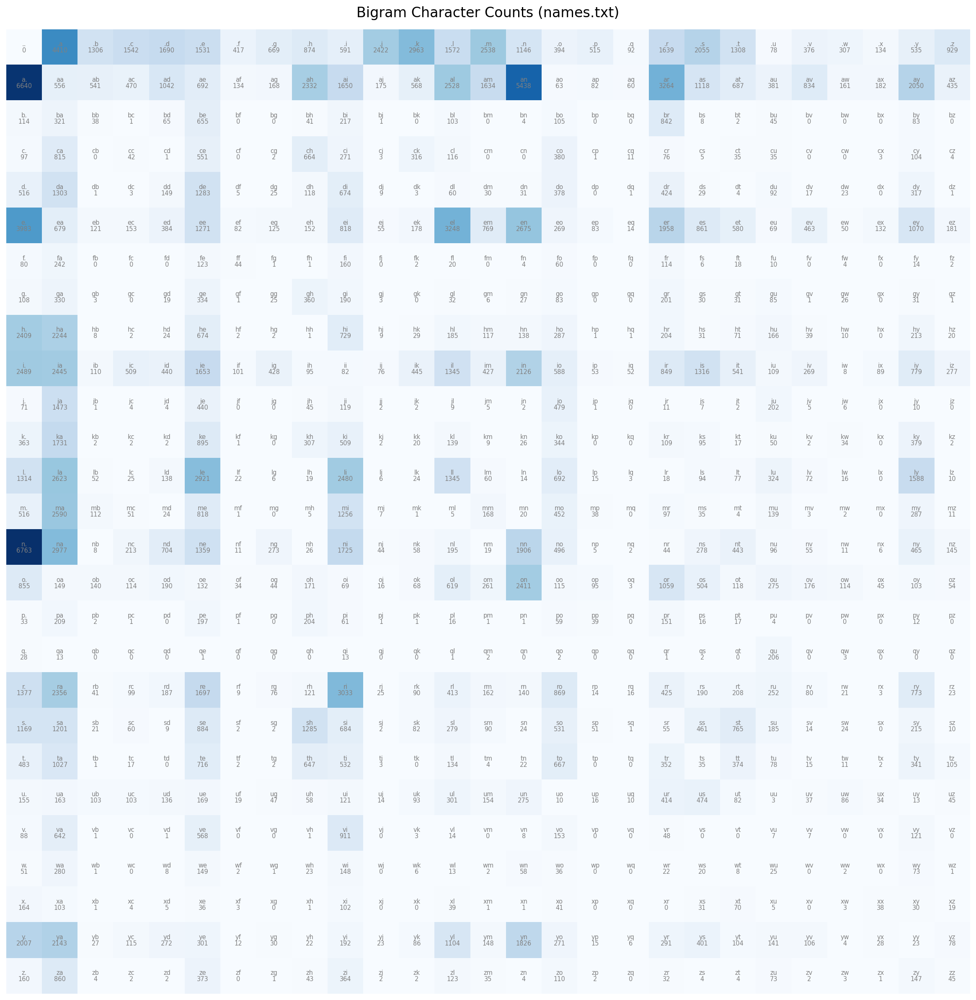

*Bigram count matrix: rows are current character, columns are next character. Bright cells show common pairs.*

**Sample names (counting model):** `cexze`, `ka`, `moliellavo`, `pen`, `aisan`

**Limitation:** the model sees only one character. It cannot know that a name starting with `an` is more likely to continue with a vowel. Every prediction uses only the immediately preceding character.

---

## Model 02 — MLP (Bengio et al. 2003)

**The limitation it fixes:** the bigram sees only 1 character. An MLP can see a fixed window of 3.

**The idea:** replace the one-hot lookup with a learned embedding table C (27x10). Concatenate 3 character embeddings into a 30-dimensional input, pass through one hidden layer with tanh, project to 27 logits. The embedding table is the key innovation: characters that behave similarly in names pull their vectors closer together during training.

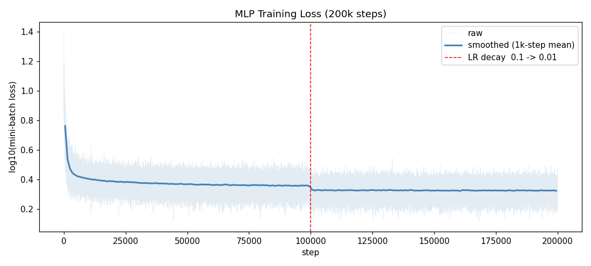

*Training loss over 200k steps (faint: raw mini-batch, bold: 1000-step smoothed mean). LR decays from 0.1 to 0.01 at step 100k.*

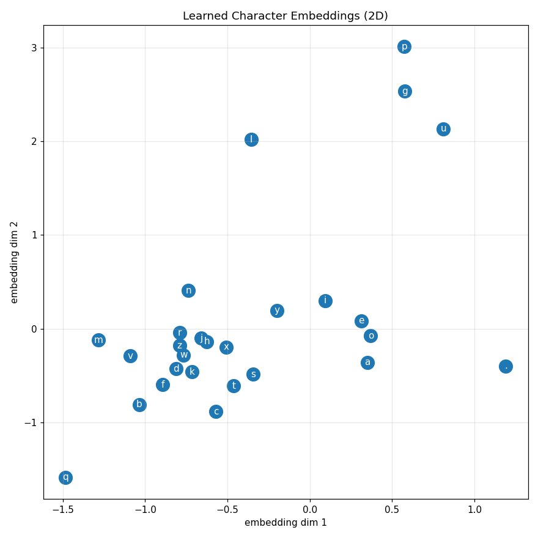

*Learned 2D character embeddings. Vowels cluster together; the start/end token '.' sits apart.*

**Final NLL:** train 2.12 | val 2.16 | parameters 11,897

**Sample names:** `maleah`, `nella`, `darrey`, `molie`, `anell`

**Limitation:** with only 3 characters of context and one hidden layer, the model saturates quickly. Making it deeper with random initialization causes training to fail the next notebook addresses this directly.

---

## Model 03 — Activations, Gradients, and BatchNorm

**The limitation it fixes:** naive deep networks fail to train. This notebook diagnoses why and fixes it.

**The idea:** a progression through five training pathologies and their fixes, culminating in a 6-layer deep MLP with BatchNorm. Each phase runs with a controlled change so the effect is isolated.

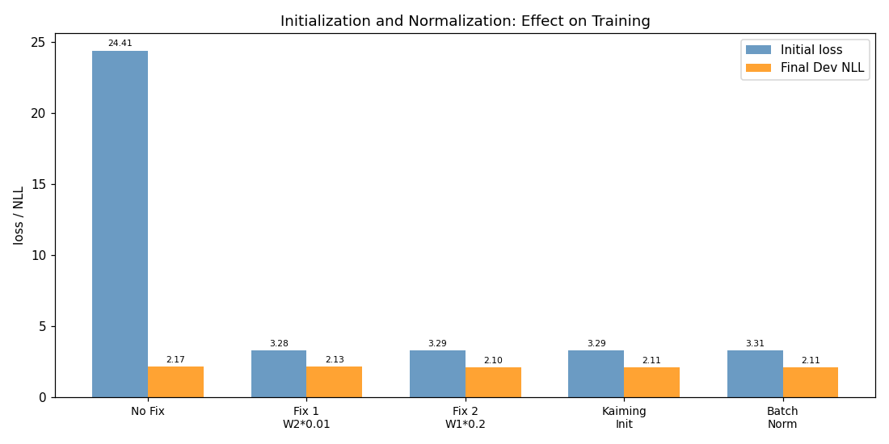

*Val NLL across the five shallow configurations. Fixing initialization brings the starting loss from 24.4 down to 3.3 (the theoretical baseline for a uniform model is 3.30).*

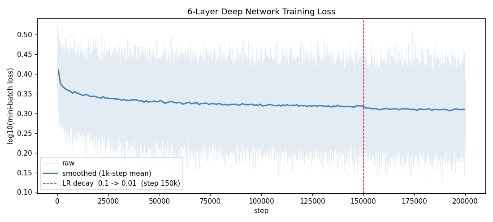

*Training loss for the 6-layer deep network. Train and val converge to the same value, confirming the bottleneck is context length (3 chars), not model capacity.*

After training, four diagnostic visualizations verify the network is healthy:

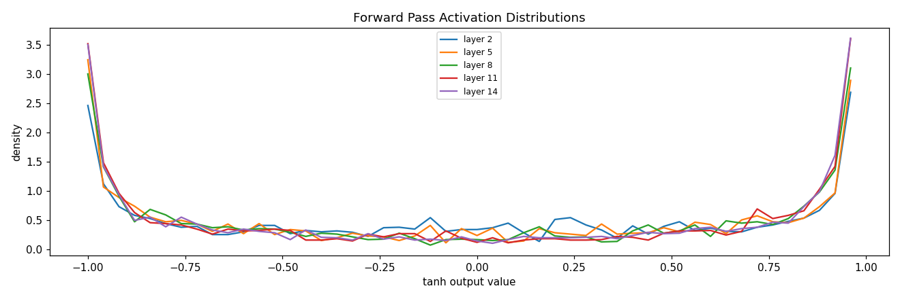

*Forward pass activation distributions across 5 Tanh layers. Healthy: mean near 0, std near 0.65, saturation below 25%.*

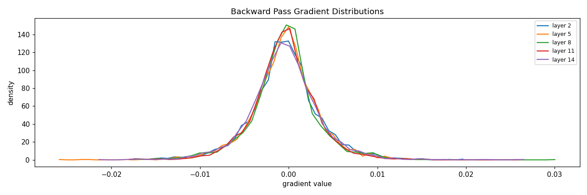

*Backward pass gradient distributions. Consistent std across all layers (~3.8e-3) confirms gradients are not vanishing.*

**Final NLL (deep model):** train 2.00 | val 2.08 | parameters 47,024

**Sample names:** `mariah`, `makilah`, `moriella`, `millie`, `kinzie`

**Limitation:** still only 3 characters of context. More layers help optimization but cannot overcome the fundamental information bottleneck of a 3-char window.

---

## Model 04 — WaveNet (van den Oord et al. 2016)

**The limitation it fixes:** the MLP flattens all context characters into one unordered vector. WaveNet introduces hierarchical fusion: characters merge in pairs, building a binary tree over 8 characters of context.

**The idea:** three `FlattenConsecutive(2)` layers stack like a binary tree. At level 1, pairs of character embeddings merge. At level 2, pairs of level-1 outputs merge (covering 4 characters). At level 3, the final merge covers all 8 characters. The receptive field doubles at each level with no additional parameters.

The notebook also catches and diagnoses a **silent BatchNorm bug**: when input is 3D `(B, T, C)`, normalizing over `dim=0` only produces running statistics with shape `(1, T, C)` instead of `(1, 1, C)`. PyTorch broadcasts this silently without error. The fix is `dim=(0, 1)`.

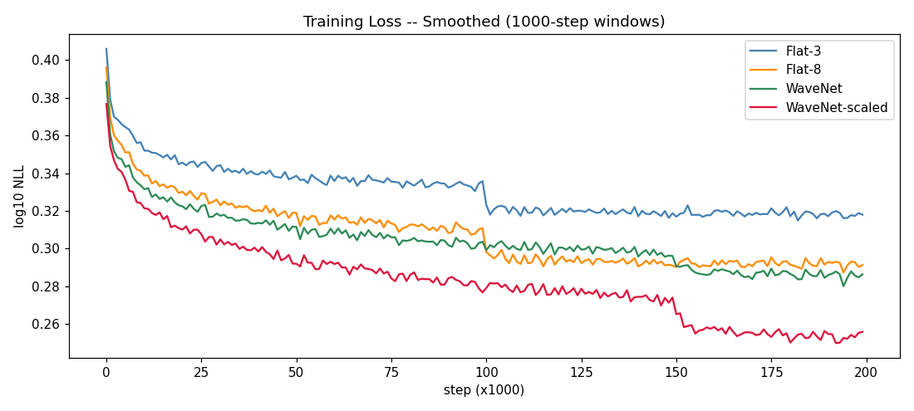

*Smoothed training loss across all four valid models. WaveNet-scaled (76k params, 8-char context) reaches the lowest training loss.*

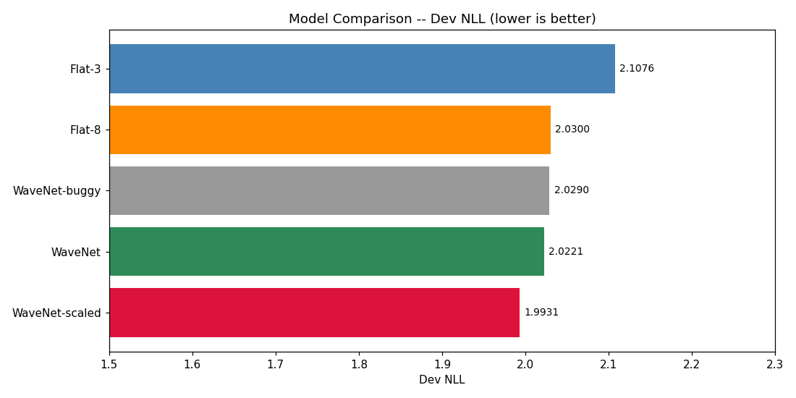

*Validation NLL comparison across all five models including the buggy BatchNorm variant (gray).*

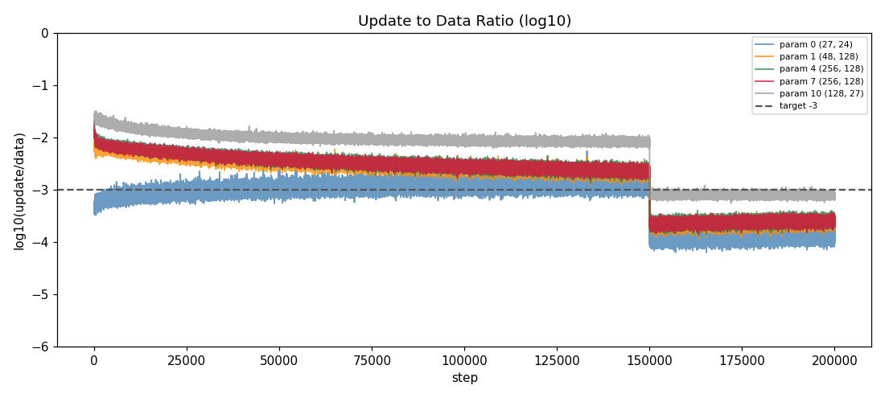

*Update/data ratios for the scaled WaveNet during training. Target: log10 ratio near -3. All parameter groups move together with none frozen.*

**Final NLL (WaveNet scaled):** train 1.77 | val 1.99 | parameters 76,579

**Sample names:** `jaleiya`, `kellie`, `samiyah`, `adelle`, `delayna`

**Limitation:** the fusion structure is fixed by architecture. A character at position 1 reaches position 8 only through the specific tree, not directly. Self-attention removes this constraint.

---

## Model 05 — Transformer (Vaswani et al. 2017)

**The limitation it fixes:** WaveNet requires O(log T) hops for any two characters to communicate. Self-attention gives every character direct O(1) access to every previous character, with attention weights learned from data rather than fixed by architecture.

**The idea:** a decoder-only GPT-style Transformer with 6 layers, 4 attention heads, 64-dimensional embeddings, and Pre-LayerNorm residual connections. The model trains on padded name sequences (block size 16) with `ignore_index=-1` so padding never contributes to the loss.

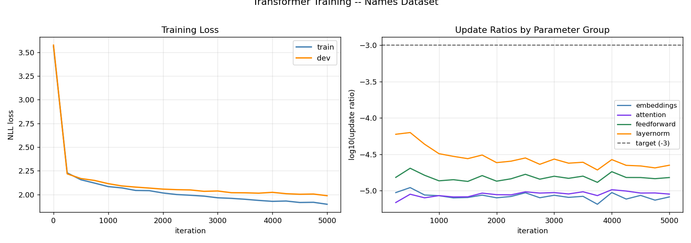

*Left: loss curve over 5000 steps. Right: log10 update/data ratios by parameter group. All groups stay healthy throughout training.*

After training, attention weights are extracted per head and per layer to verify what each head learned. Three predictions were made before inspecting the weights:

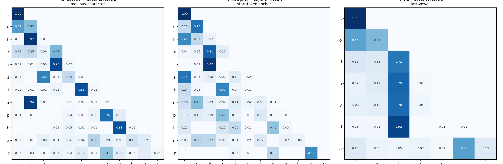

*Left: Layer 1 Head 2 on "christopher" — previous-character head (near-diagonal). Center: Layer 5 Head 0 on "christopher" — start-token anchor (column 0 dominates). Right: Layer 5 Head 3 on "olivia" — last-vowel head.*

The previous-character and start-anchor predictions held. The last-vowel prediction only partially held: early layers that appeared to track vowels were actually the previous-character head catching adjacent vowels. Only Layer 5 Head 3 showed genuine vowel-seeking behavior, revealing a position-vs-content confound.

Full attention grids for all four test names:

| olivia | anna | christopher | mia |
|---|---|---|---|
| 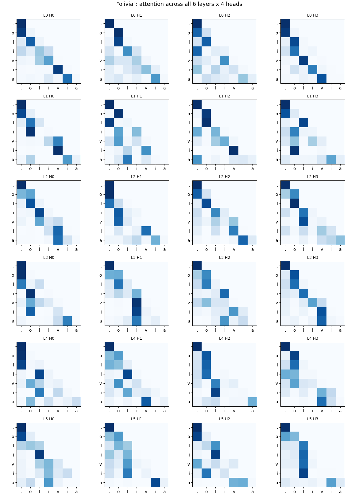 | 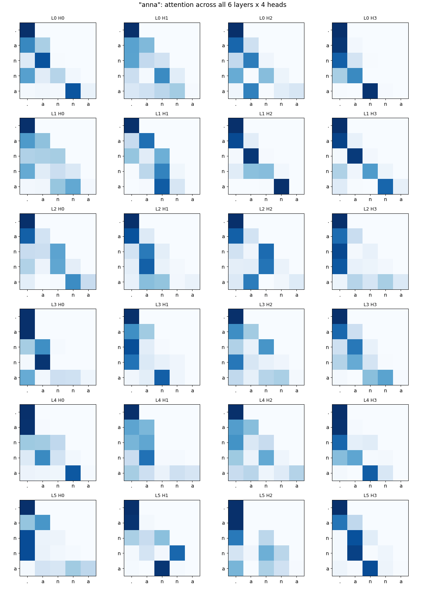 | 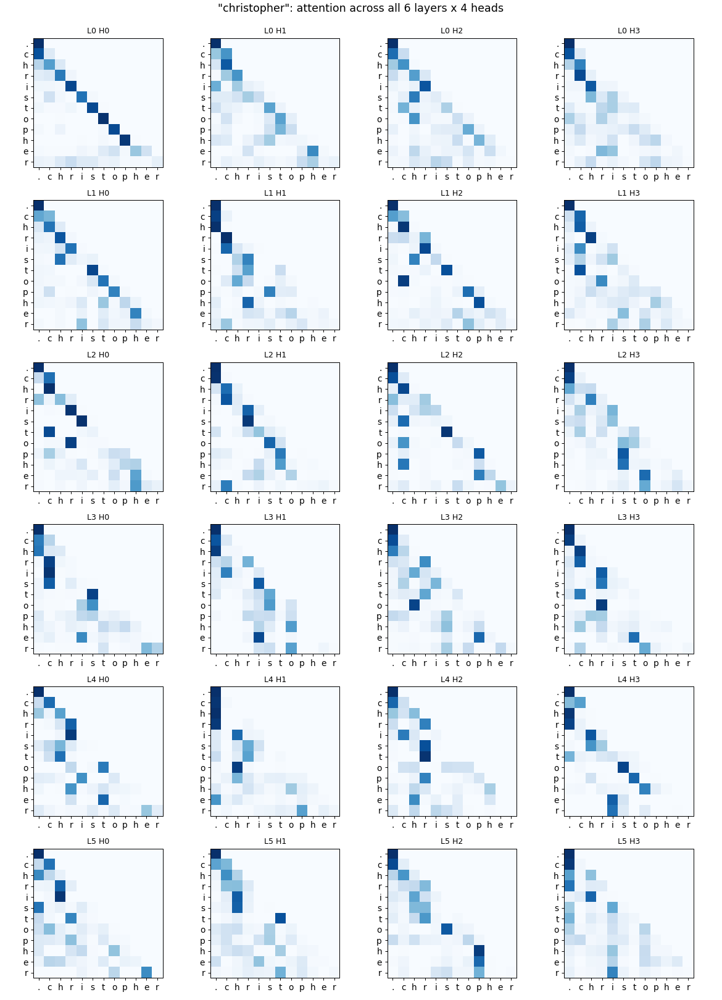 | 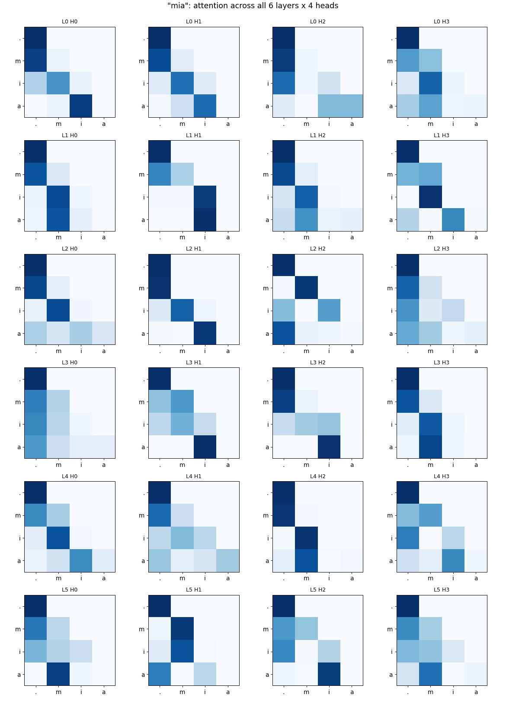 |

*All 6 layers x 4 heads per name. Early layers show local diagonal patterns. Late layers show global patterns.*

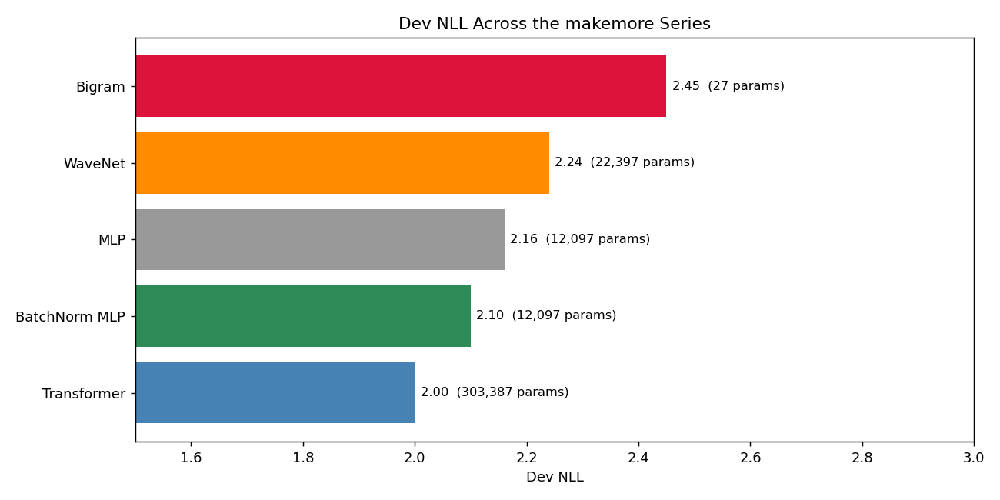

*Validation NLL across the full series. The Transformer (2.00) edges out the BatchNorm MLP (2.08). WaveNet sits between them due to overfitting on the small 32k-name dataset.*

**Final NLL:** train 1.91 | val 2.00 | test 2.00 | parameters 303,387

**Sample names:** `kayleigh`, `bailey`, `julieth`, `maril`, `calleig`, `dasire`

---

## Utilities

`utils/diagnostics.py` extracts the four training diagnostic visualizations from notebooks 03 and 04 into a reusable module. Each function works on any PyTorch network:

```python
from utils.diagnostics import (
    plot_activation_distributions,   # forward pass health check
    plot_gradient_distributions,     # backward pass health check
    plot_weight_grad_ratios,         # per-weight gradient to data ratio
    plot_update_ratios,              # update magnitude over training steps
)
```

All four functions accept `save_path=None` and `show=False` so they work in both scripts (save to disk) and notebooks (display inline). Used in scripts 03, 04, and 05.

---

## Generated names across the series

| Model | Sample names |
|---|---|
| Bigram counting | `cexze`, `ka`, `moliellavo`, `br`, `ja` |
| MLP | `maleah`, `nella`, `darrey`, `rugotti`, `anell` |
| Deep MLP + BatchNorm | `mariah`, `makilah`, `moriella`, `millie`, `kinzie` |
| WaveNet | `jaleiya`, `kellie`, `samiyah`, `adelle`, `delayna` |
| Transformer | `dasire`, `bailey`, `aviena`, `maril`, `zendy` |

---

## References

- Bengio et al. 2003 — [A Neural Probabilistic Language Model](https://www.jmlr.org/papers/volume3/bengio03a/bengio03a.pdf)
- van den Oord et al. 2016 — [WaveNet: A Generative Model for Raw Audio](https://arxiv.org/abs/1609.03499)
- Vaswani et al. 2017 — [Attention Is All You Need](https://arxiv.org/abs/1706.03762)
- Ioffe and Szegedy 2015 — [Batch Normalization](https://arxiv.org/abs/1502.03167)
- He et al. 2015 — [Delving Deep into Rectifiers (Kaiming init)](https://arxiv.org/abs/1502.01852)

Built while working through Andrej Karpathy's [Neural Networks: Zero to Hero](https://karpathy.ai/zero-to-hero.html).

---

## Related repositories

**[microgradplus](https://github.com/Nur2424/microgradplus)** — the scalar autograd engine that motivated this series. Every gradient computed in these models traces back to the same mathematical operations implemented there from scratch.

**[tensorgrad](https://github.com/Nur2424/tensorgrad)** — planned extension: tensor-level autograd with hand-derived gradients for matrix operations, connecting to training a language model without PyTorch.
